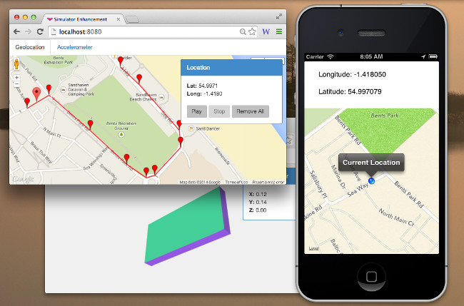

# iOS Simulator Enhancements

This project is a proof-of-concept, which I am using to try out a few ideas around extending the capabilities of the iOS Simulator. This project provides a mechanism for 'injecting' sensor data into an application in order to test code that depends on the accelerometer or GPS data without the need for a real device.

To use this code, add the contents of the `SimulatorEnhancements` into your project, then add the following to the start of your app:

	// enable interruption of location and motion manager methods
    [[CESimulatorEnhancements instance] enable];
    
    // start polling 'localhost for updates
    [[CESimulatorEnhancements instance] startClient];
    
Once this is done, the app will poll `localhost/data` requesting the current, simulated, location and accelerometer data.

To simulate this data, use the SimulatorEnhancements-Server project, which is a simple we server that provides data in the following format:

	{
	  accelerometer: { x: 0.56, y: 0.0, z: 0.45 },
	  location: { latitude: 54.99, longitude: -1.41 }
	}

